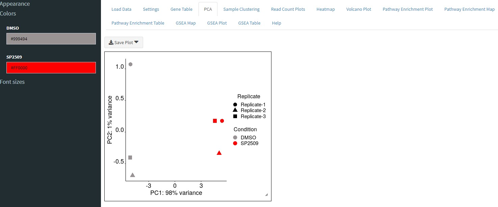
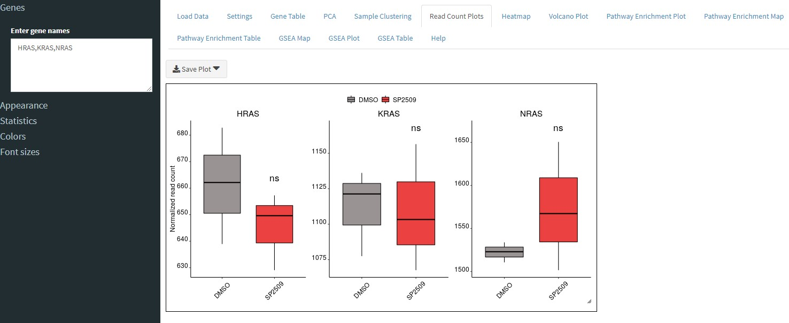
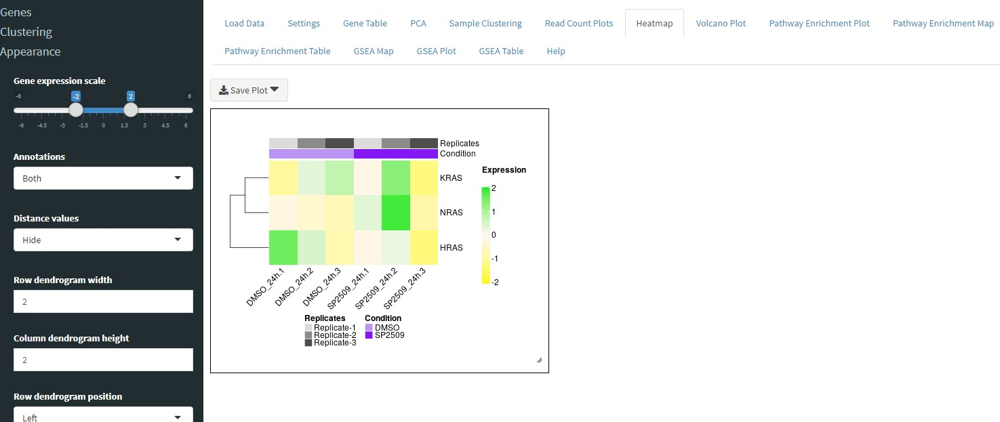
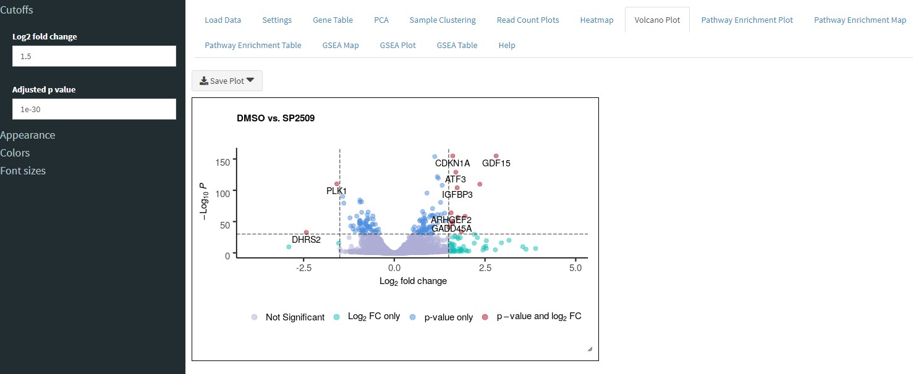

# BEAVR
A **B**rowser-based tool for the **E**xploration **A**nd **V**isualization of **R**NAseq data 

BEAVR is a graphical tool to automate analysis and exploration of small and large RNAseq datasets using DESeq2.

**The latest release can be downloaded [here](https://github.com/developerpiru/BEAVR/releases/latest).**

# Table of contents

+ [Installation & Requirements](https://github.com/developerpiru/BEAVR#installation--requirements)
	+ [Use the Docker container](https://github.com/developerpiru/BEAVR#Use-the-Docker-container)
	+ [Setup a new R environment with the automated installer](https://github.com/developerpiru/BEAVR#Setup-a-new-R-environment-with-the-automated-installer)
	+ [Run in your existing R installation](https://github.com/developerpiru/BEAVR#Run-in-your-existing-R-installation)
	+ [Installing BEAVR on a server with multi-user support]()

+ [Usage](https://github.com/developerpiru/BEAVR#usage)

	+ [Preparing the read count table file](https://github.com/developerpiru/BEAVR#preparing-the-read-count-table-file)
	+ [Preparing the sample treatment matrix file](https://github.com/developerpiru/BEAVR#preparing-the-sample-treatment-matrix-file)
	+ [Loading your data into BEAVR](https://github.com/developerpiru/BEAVR#loading-your-data-into-beavr)
	+ [Experiment settings](https://github.com/developerpiru/BEAVR#experiment-settings)
	+ [Differential gene expression (DGE) analysis](https://github.com/developerpiru/BEAVR#differential-gene-expression-analysis-dge)
	+ [Plots, graphs and heatmaps](https://github.com/developerpiru/BEAVR#plots-graphs-and-heatmaps)
  	+ [PCA plot](https://github.com/developerpiru/BEAVR#pca-plot)
  	+ [Sample clustering plot](https://github.com/developerpiru/BEAVR#sample-clustering-plot)
 	 + [Read count plot](https://github.com/developerpiru/BEAVR#read-count-plots)
 	 + [Heatmap](https://github.com/developerpiru/BEAVR#heatmap)
  	+ [Volcano plot](https://github.com/developerpiru/BEAVR#volcano-plot)
  	+ [Resizing and saving images](https://github.com/developerpiru/BEAVR#resizing-and-saving-images)
  
+ [Known bugs & error messages](https://github.com/developerpiru/BEAVR#known-bugs--error-messages)

# Installation & Requirements

We provide three ways to install and use BEAVR. They vary in ease and speed to get BEAVR running on your computer:
	1. [Use a Docker container]() - the easiest and fastest method
	2. [Setup a new R environment with the automated installer]() - for those who don't want to install Docker
	3. [Run in your existing R installation]() - for those who already have R installed

## Use the Docker container

The easiet way to install and use BEAVR - especially for those who have no R, programming, or command line experence - is to use our Docker container. Follow these instructions to get started:

1. Download and extract the BEAVR-Docker setup package for your operating system:
	- [Windows](https://github.com/developerpiru/BEAVR/raw/master/Docker%20Setup/BEAVR-Docker-Win.zip)
	- [Mac OS](https://github.com/developerpiru/BEAVR/raw/master/Docker%20Setup/BEAVR-Docker-Mac.zip)
	- [Linux](https://github.com/developerpiru/BEAVR/raw/master/Docker%20Setup/BEAVR-Docker-Linux.tar.gz)
	
2. Install Docker for your operating system:
	On Windows and Mac OS, you can download the latest installer from Docker and use their installation wizard:
	- [Docker Desktop for Windows](https://docs.docker.com/docker-for-windows/install/)
	
	- [Docker Desktop for Mac OS](https://docs.docker.com/docker-for-mac/install)
	
	- On Linux, you can use our automated installer in the BEAVR-Docker-Linux package you downloaded above (called **Docker-setup-ubuntu.sh**). You will need to open a terminal and enter this command to execute it:
		```
		bash Docker-setup-ubuntu.sh
		```
		
3. Run (pull) our Docker container:
	- On Windows, double click **Run-BEAVR.bat** in the BEAVR-Docker setup package you downloaded above
	
	- On Mac, double click **Run-BEAVR.sh** in the BEAVR-Docker-Mac package you downloaded above
	
	- On Linux, enter ```bash Run-BEAVR.sh``` in a terminal.

4. Open your browser and enter ```localhost:3838``` in the address bar to use BEAVR.


Once the Docker container is donwloaded to your computer, you can also access it from the Docker Dashboard  as shown below (only on Windows and Mac OS):


You can use this interface to start, stop, or open a browser to ```localhost:3838``` (circled in red) without using Run-BEAVR.bat or Run-BEAVR.sh executable scripts as explained in step 3 above. 

However, keep in mind that this only runs your current locally downloaded version of BEAVR. To get the most up-to-date version, follow step 3 to update your local copy.

## Setup a new R environment with the automated installer

If you prefer not to install Docker and **you do not already have R installed** on your computer, you can follow these steps to easily install and configure R for BEAVR.

### Windows and Mac OS

1. Download and extract the BEAVR-base setup files for your operating system:
	- [Windows]()
	- [Mac OS]()

2. Install R for your operating system:
	- On Windows, download R 3.6.3 [here](https://cloud.r-project.org/bin/windows/base/R-3.6.3-win.exe)
	
	- On Mac OS, download R 3.6.3 for Catalina [here](https://cloud.r-project.org/bin/macosx/R-3.6.3.pkg) or for El Capitan and higher [here](https://cloud.r-project.org/bin/macosx/R-3.6.3.nn.pkg)

3. Run the automated installer to install and configure required packages:
	- On Windows, double click **Configure-BEAVR.bat** in the BEAVR-base setup package you downloaded above
	
	- On Mac OS, double click **Configure-BEAVR.sh** in the BEAVR-base package you downloaded above
	
	This will download and install the R packages required for BEAVR.

4. Run BEAVR:
	- On Windows, double click **Run-BEAVR.bat**
	
	- On Mac OS, double click **Run-BEAVR.sh**
	
### Linux

1. Download and extract the BEAVR-base setup files for Linux:
	- [Linux]()
	
2. Run the automated installer (called **BEAVR-setup.sh**). You will need to open a terminal and enter this command to execute it:
	```
	bash BEAVR-setup.sh
	```
	This will install the latest version of R and also download and configure all of the required R packages for BEAVR automatically.

3. To run BEAVR, enter this command from a terminal:
	```
	bash Run-BEAVR.sh
	```

## Run in your existing R installation

If you already have a working installation of R on your computer (version 3.5+), then you can follow these steps to install the required R packages to run BEAVR on any operating system.

	Note, the required packages are as follows:
	```
	#CRAN packages
	BiocManager
	colourpicker
	data.table
	devtools
	DT
	ggplot2
	ggpubr
	ggrepel
	ggraph
	gridExtra
	pheatmap
	RColorBrewer
	scales
	shiny
	shinydashboard
	shinyWidgets
	shiny
	shinydashboard
	shinyjqui
	shinyWidgets
	shinycssloaders
	circlize

	#Bioconductor packages
	DESeq2
	vsn
	apeglm
	org.Hs.eg.db
	org.Mm.eg.db
	ReactomePA
	enrichplot

	#GitHub packages
	kevinblighe/EnhancedVolcano
	jokergoo/ComplexHeatmap
	```

### Windows

1. Download the BEAVR-R setup package from [here]()

2. Double click **Configure-BEAVR.bat** in the BEAVR-base setup package you downloaded above

3. To start BEAVR, double click **Run-BEAVR.bat**

### Mac OS

1. Download the BEAVR-R setup package from [here]()

2. Double click **Configure-BEAVR.sh** in the BEAVR-base setup package you downloaded above

3. To start BEAVR, double click **Run-BEAVR.sh**

### Linux

1. Download the BEAVR-R setup package from [here]()

2. Run the automated installer (called **installpkgs.R**) to configure the required packages. You will need to open a terminal and enter this command to execute it:
	```
	sudo Rscript installpkgs.R
	```
	
3. To start BEAVR, double click **Run-BEAVR.sh**

## Installing BEAVR on a server with multi-user support

If you wish to have BEAVR running on a centralized server for your research group, you or your system administrator can follow the instructions below. We implement this using Docker and ShinyProxy which allows each user to be sandboxed in a unique Docker instance. These instructions are provided for Linux/Ubuntu servers (for now)

1. Download and extract the **BEAVR-multi-server-setup.tar.gz** setup package from [here](https://github.com/developerpiru/BEAVR/raw/master/BEAVR-multi-server-setup.tar.gz)

2. If you already have Docker installed on your Ubuntu server, continue to step 3. Otherwise, in the setup package you just downloaded, run the Docker installer by entering this command in a terminal (this will remove any previous version of Docker!):
	```
	bash Docker-setup-ubuntu.sh
	```
3. If you already have Java 8 runtime environment installed on your Ubuntu server, skip to step 4. Otherwise, in the setup package you just downloaded, run the OpenJDK installer by entering this command in a terminal (you can use another distribution of JDK like Oracle as well):
	```
	bash OpenJDK-setup.sh
	```
4. Finally, run the script **ShinyProxy-setup.sh** to configure Docker and setup ShinyProxy:
	```
	bash ShinyProxy-setup.sh
	```
	This will download ShinyProxy 2.3.0 (shinyproxy-2.3.0.jar) and configure the Docker daemon to communicate on port 2375.
	
5. Configure ShinyProxy settings for user access:
	If you look in the setup package you downloaded in step 1, you will see a file named **application.yml**
	
	The bottom part of this file is pre-configured for BEAVR already.
	
	In the top portion of the file, you will find the configuration line for the port (default 8080) and for user access control:
		- You can keep the default "simple" authentication method and specify user names and passwords in this file (note this file is not encrypted!)
		- You can also LDAP authentication or social authentication
		- You can set this to "none" to have no authentication so anyone with the address can access the server
		- See the [ShinyProxy documentation](https://www.shinyproxy.io/configuration/) for more information regarding authentication
	
# Usage

BEAVR requires two file inputs:
1. [Read count table file](https://github.com/developerpiru/BEAVR#preparing-the-read-count-table-file)
2. [Sample treatment matrix file](https://github.com/developerpiru/BEAVR#preparing-the-sample-treatment-matrix-file)

See the [**Examples**](https://github.com/developerpiru/BEAVR/tree/master/Examples) folder for examples of these two files prepared for the [Sehrawat *et al.* (2018)](https://www.ncbi.nlm.nih.gov/pmc/articles/PMC5939079/) dataset. 

## Preparing the read count table file

The **read counts table file** contains all the raw reads for all the samples in your experiment in a tab-delimited (.txt) or comma-separated (.csv) file type.

The table must be arranged as follows:
1. The first column must contain ENSEMBL IDs for every gene. The heading name for this column must be ```gene_id```.
2. The next ```n``` columns must contain the raw read counts for each ```n``` samples. Label the heading name for each column with a unique sample/replicate identifier.

Here is what it looks like for the [Sehrawat *et al.* (2018)](https://pubmed.ncbi.nlm.nih.gov/29581250-lsd1-activates-a-lethal-prostate-cancer-gene-network-independently-of-its-demethylase-function/) dataset in Microsoft Excel:


The `gene_id` column contains ENSEMBL IDs for each gene. 
The columns labelled `DMSO_24h-1, DMSO_24h-2, DMSO_24h-3, SP2509_24h-1, SP2509_24h-2, SP2509_24h-3` are the unique samples/replicates in the experiment and contain the raw, unnormalized read quantities for each gene for eacn sample.

## Preparing the sample treatment matrix file

The **sample treatment matrix file** informs BEAVR which columns in the read count file belong to which treatment groups (ie. Untreated and Treated, or Wildtype and Mutant). The file type may be tab-delimited (.txt) or comma-separated (.csv).

The table must be arranged as follows:
1. The first column must list the sample or replicate identifiers of each sample you have in your read counts file. For example, for ```n``` samples in the read counts file, you must have ```n``` rows in the column data file. Each row is a unique sample. The heading name for this column can be left blank (it is not used).
	- **Note:** it is critical that the order of the samples here (each row) is in the **same order** as the samples (each column) in the read count table file!
2. The second column identifies which treatment condition/group the samples belong to. The heading name for this column must be ```condition```. For example, in each row of this column, you must identify that respective sample as belonging to ```Untreated``` or ```Treated``` or ```Wildtype``` or ```Mutant```.
3. In the third column, you can specify additional characteristics for each sample. For example, you can specify different genotype groups or replicates like ```Replicate-A```, ```Replicate-B```, and ```Replicate-C``` (must be alphanumeric). The heading name for this column must be ```replicate```.

Here is the sample treatment matrix file prepared for the [Sehrawat *et al.* (2018)](https://pubmed.ncbi.nlm.nih.gov/29581250-lsd1-activates-a-lethal-prostate-cancer-gene-network-independently-of-its-demethylase-function/) dataset in Microsoft Excel:


## Loading your data into BEAVR

On the ```Load data``` tab, select the files you have prepared. Make sure you select the correct file type format for each file. 


## Experiment settings

On the ```Settings``` tab, you can select the reference organism, the control condition and the treatment condition, the false discovery rate used for statistics, and the minimum read count required for each gene (genes below this value will be dropped from analysis).

## Differential gene expression analysis (DGE)

Click on the ```Gene Table``` tab to begin calculations. You will see a progress bar in the bottom right-hand corner of the window. The results will be displayed in a table format which you can search, order and filter and download using the sidebar. 


PCA plot, sample clustering/correlation plot, read count plots, heatmap, and volcano plot for your experiment. All graphs and plots can be saved by right clicking on the image and saving as an image.

## Plots, graphs and heatmaps

Each of the other tabs will provide output of plots, graphs, and heatmaps for the data you provided.

### PCA plot

The ``PCA`` tab will plot each sample on the same plot and show you the variances between samples. 



You can customize the plot using the sidebar controls.

### Sample clustering plot

The ```Sample clustering``` tab will cluster samples by rows and columns depending on the variance.


You can customize the plot using the sidebar controls, including the distance measurement method used. For example, selecting Pearson will produce a Pearson correlation plot.

### Read count plots

The ```Read count plots``` tab will allow you to plot the normalized read counts for any number of genes you specify.



You can enter genes in the sidebar separated by a comma (no spaces, as shown in image). You can specify a grid layout to show multiple plots. For example, specify 2 rows by 2 columns to show 4 plots in a square format. Or you can specify 4 rows by 1 column to show them in a stacked column format. You can also customize the position of the legend or not show a legend at all.

You can also chose to display the read counts in a jitter plot instead of a box plot:


### Heatmap

The ```Heatmap``` tab will allow you to display the differential expression of genes in a clustered heatmap. You can use the sidebar controls to specify the type of clustering for rows and/or columns and also customize things like the color and font sizes.

You can enter a list of genes separated by a comma to make a heatmap of genes you are interested in. Alternatively, if you want to make a heatmap of the top differentially expressed genes, select the checkbox ```Show top genes instead``` and then enter the number of top genes to show  (e.g. the top 10, 50, 100, etc.). Note: increasing the number of genes to show will increase processing time to perform clustering.



### Volcano plot

The ```Volcano plot``` tab will plot the differentially expressed genes in a volcano plot format which, unlike the heatmap, will also display the p value information for each gene. You can use the sidebar controls to specify the cutoffs for the log2 fold change (LFC) and the p value - this is to color the points that meet these cutoffs.



If filtering is enabled in the ```Gene Table``` plot, then only those filtered genes will be used to make the volcano plot. Otherwise, all the genes from the Gene Table will be used.

### Resizing and saving images

Any of the plots, graphs, and heatmaps can be resized by clicking and dragging the edges. 
You can save them by right clicking and choosing "save image as".

# Known bugs & error messages

 Issue | Solution
---------|---------
**Bug:** PCA plot, gene read count plot, and volcano plot won't auto-update after changing the treatment condition. The results table will update correctly. | Edit the parameters in the sidebar for PCA/read count/volcano plots or refresh the page.
**Error message:**```ncol(countData) == nrow(colData) is not TRUE``` | The samples (columns) in your read count table file do not match the samples (rows) in your sample treatment matrix file. Please check to make sure sample names match and that you've selected the correct files (and formats: .csv or .txt) to load into BEAVR.
**Error message:**```None of the keys entered are valid keys for 'ENSEMBL'. Please use the keys method to see a listing of valid arguments``` | This means the ENSEMBL IDs contained in your read count table file cannot be mapped to the reference genome you selected in the Experiment settings tab. Please verify you have selected the correct one.
**Error message:**```mapIds must have at least one key to match against.``` | This error typically occurs when the read count table file is not in the correct format/file type. Please save the file as "CSV (Comma delimited) (.csv)" and not "CSV UTF-8 (Comma delimited) (.csv)".


