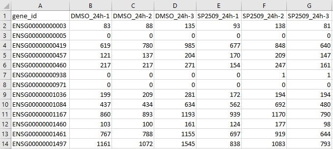
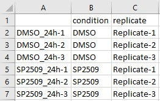

# BEAVR

BEAVR: A **B**rowser-based tool for the **E**xploration **A**nd **V**isualization of **R**NAseq data. 

BEAVR is a graphical tool to automate analysis and exploration of small and large RNAseq datasets using DESeq2.

# Release

Current stable release is version 0.75.2

# Installation & Requirements

You must have the following components installed in order to run BEAVR:
- R 3.5+	
- library("BiocManager")
- library("shiny")
- library("shinydashboard")

To install the required packages, enter these commands in R:

	install.packages("BiocManager")
	install.packages("shiny")
	install.packages("shinydashboard")

As of version 0.62, all other required packages will be installed automatically. If you run into an error, make sure you have R 3.5+ installed and try reinstalling the above packages. 

# Run BEAVR

Load the required libraries for launch and run the latest version of BEAVR using:

	library(shiny)
	library(shinydashboard)
	runGitHub( "BEAVR", "developerpiru")

If you are using R, a browser window should open automatically showing the app. If you are using RStudio, click "Open in browser" in the window that opens.

# Usage

BEAVR requires two file inputs:
1. Read counts file
2. Column data file

See the **Examples** folder for examples of these two files prepared for the Sehrawat *et al.* (2018) dataset. 

## Preparing the read count table file

The **read counts table file** contains all the raw reads for all the samples in your experiment in a tab-delimited (.txt) or comma-separated (.csv) file type.

The table must be arranged as follows:
1. The first column must contain ENSEMBL IDs for every gene. The heading name for this column must be ```gene_id```.
2. The next ```n``` columns must contain the raw read counts for each ```n``` samples. Label the heading name for each column with a unique sample/replicate identifier.

Here is what it should like if you prepare it in Microsoft Excel:


The `gene_id` column contains ENSEMBL IDs for each gene. 
The columns labelled `DMSO_24h-1, DMSO_24h-2, DMSO_24h-3, SP2509_24h-1, SP2509_24h-2, SP2509_24h-3` are the unique samples/replicates in the experiment and contain the raw, unnormalized read quantities for each gene for eacn sample.

## Preparing the sample treatment matrix file

The **sample treatment matrix file** informs BEAVR which columns in the read count file belong to which treatment groups (ie. Untreated and Treated, or Wildtype and Mutant). The file type may be tab-delimited (.txt) or comma-separated (.csv).

The table must be arranged as follows:
1. The first column must list the sample or replicate identifiers of each sample you have in your read counts file. For example, for ```n``` samples in the read counts file, you must have ```n``` rows in the column data file. Each row is a unique sample. The heading name for this column can be left blank (it is not used).
	- **Note:** it is critical that the order of the samples here (each row) is in the **same order** as the samples (each column) in the read count table file!
2. The second column identifies which treatment condition/group the samples belong to. The heading name for this column must be ```condition```. For example, in each row of this column, you must identify that respective sample as belonging to ```Untreated``` or ```Treated``` or ```Wildtype``` or ```Mutant```.
3. In the third column, you can specify additional characteristics for each sample. For example, you can specify different genotype groups or replicates like ```Replicate-A```, ```Replicate-B```, and ```Replicate-C``` (must be alphanumeric). The heading name for this column must be ```replicate```.

Here is the sample treatment matrix file prepared for the Sehrawat *et al.* (2018) dataset in Microsoft Excel:


## Load your data into BEAVR

On the ```Load data``` tab, select the files you have prepared. Make sure you select the correct file type format for each file. 


## Experiment settings

On the ```Settings``` tab, you can select the reference organism, the control condition and the treatment condition, the false discovery rate used for statistics, and the minimum read count required for each gene (genes below this value will be dropped from analysis).

## Differential gene expression analysis (DGE)

Click on the ```Gene Table``` tab to begin calculations. You will see a progress bar in the bottom right-hand corner of the window. The results will be displayed in a table format which you can search, order and filter and download using the side bar. 


Once complete, you can view the resulting data table, PCA plot, sample clustering/correlation plot, read count plots, heatmap, and volcano plot for your experiment. All graphs and plots can be saved by right clicking on the image and saving as an image.

## Plots, graphs, and heatmaps


# Known Bugs & Error messages

 Issue | Solution
---------|---------
**Bug:** PCA plot, gene read count plot, and volcano plot won't auto-update after changing the treatment condition. The results table will update correctly. | Edit the parameters in the sidebar for PCA/read count/volcano plots.
**Error message:**```ncol(countData) == nrow(colData) is not TRUE``` | The samples (columns) in your read count table file do not match the samples (rows) in your sample treatment matrix file. Please check to make sure sample names match and that you've selected the correct files (and formats: .csv or .txt) to load into BEAVR.
**Error message:**```None of the keys entered are valid keys for 'ENSEMBL'. Please use the keys method to see a listing of valid arguments``` | This means the ENSEMBL IDs contained in your read count table file cannot be mapped to the reference genome you selected in the Experiment settings tab. Please verify you have selected the correct one.

